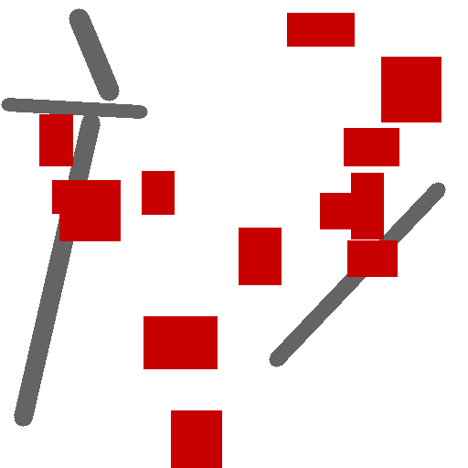
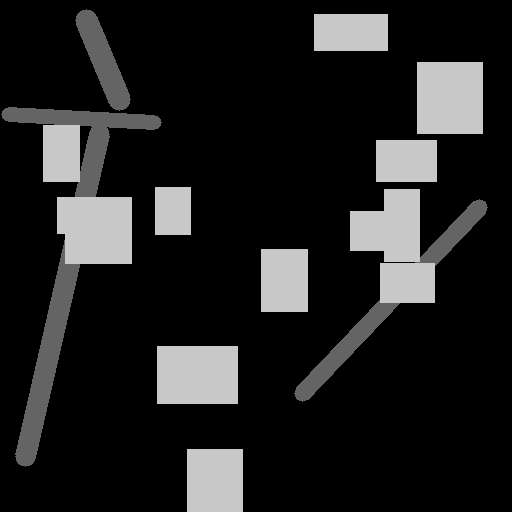
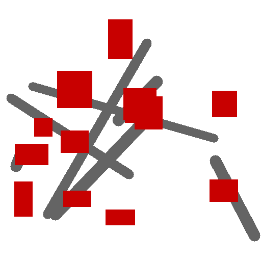

# Semantic Segmentation for Mobile Mapping & Historical Maps

## Project Overview
This project focuses on automating the extraction of semantic features (e.g., roads, buildings, labels) from **Mobile Mapping Data** and **Historical Maps**.

Addressing the challenge of **data scarcity** in historical cartography, this repository explores the use of **U-Net architectures** trained on **synthetic data** to bootstrap segmentation models for real-world datasets. This aligns with modern approaches in computational cartography where manual annotation is costly or infeasible.

## Objectives
- **Data Pipeline:** Implement a pipeline to generate synthetic map tiles with ground-truth labels.
- **Model Architecture:** Train a U-Net (ResNet backbone) for pixel-wise classification.
- **Domain Adaptation:** Evaluate the model's performance on real scanned maps vs. synthetic training data.

## Tech Stack
- **Deep Learning:** PyTorch, Torchvision
- **Image Processing:** OpenCV, Albumentations
- **Data Handling:** NumPy, Pandas, GeoPandas

## Roadmap
- [ ] Setup virtual environment and dependencies.
- [ ] Implement U-Net architecture in PyTorch.
- [ ] Create a synthetic data generator script (Bootstrap strategy).
- [ ] Training loop and validation metrics (IoU, Dice Score).

## Context
This work is inspired by problems in **Automated Cartography** and **Spatial Analysis**, specifically regarding the "Automatic Uncertainty-Aware Synthetic Data Bootstrapping" problem discussed in recent geoinformatics literature.

## 📊 Generated Results (Synthetic Data)
Below are samples generated by the bootstrapping algorithm. The model learns to segment roads (grey) and buildings (red) from the background.

| Input Map (Synthetic) | Ground Truth Mask |
|-----------------------|-------------------|
|  |  |
|  |  |

> *Note: In the masks, pixel values represent classes: 0=Background, 1=Road, 2=Building. (Visualized here with contrast enhancement).*

---
*Melih Levent Aslan | M.Sc. Student, University of Bonn*
